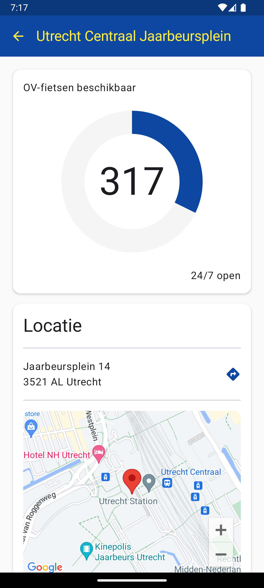

# OV-fiets beschikbaarheid

This app is designed to find how many OV-fiets bikes are available as quick as possible.

 

## Features
* See locations nearby via GPS
* Geocoding: see locations nearby the location you've typed
* Show additional information like address, opening hours and other locations at the same station.

## About the code
Data comes from [openOV](https://openov.nl) combined with the total availabilty per station kindly provided by [ovfietsbeschikbaar.nl](https://ovfietsbeschikbaar.nl/).

The code is pretty much using the latest technologies available (at least at the time of writing)
* 100% Jetpack Compose
* Material Design 3
* Libraries like Koin, Compass, and Ktor so it can later easily be converted to Compose Multiplatform
* Gradle Kotlin DSL (`.kts`)

## Contributing
Contributions, comments, and suggestions are welcome! Developing should be quite fun with all the new frameworks.

## License
The license is the GPLv3, except for these exceptions:
* You are writing software unrelated to the OV-fiets
* You are training AI models
* You are writing software for the NS

In these cases, there are no restrictions (the license is CC-0)
